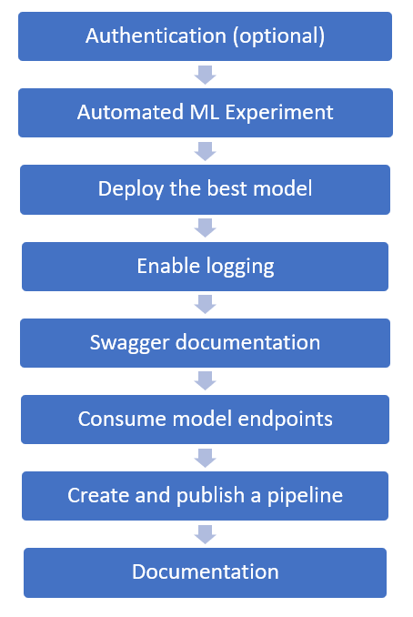
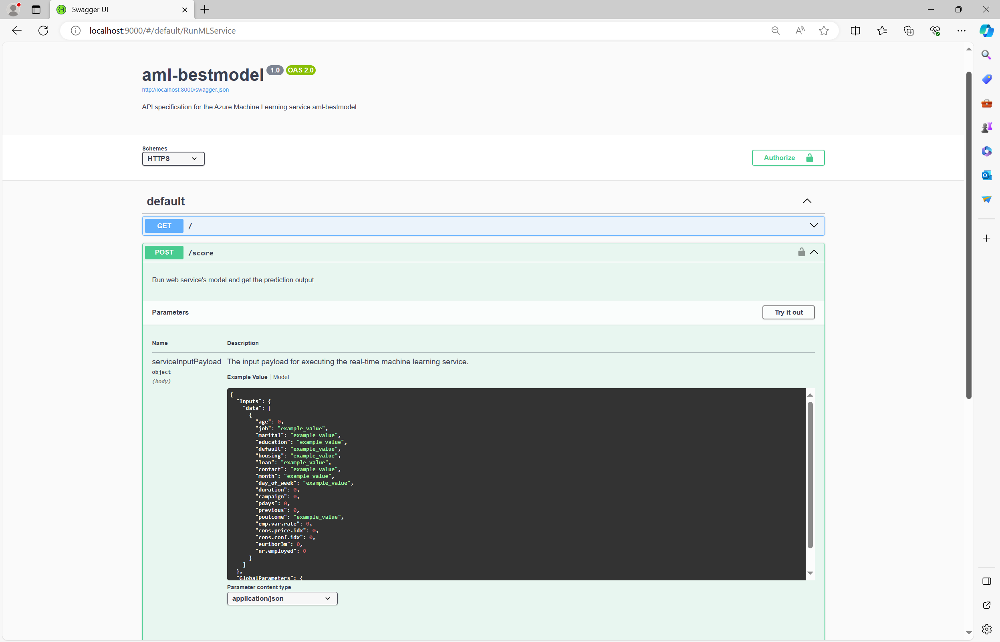
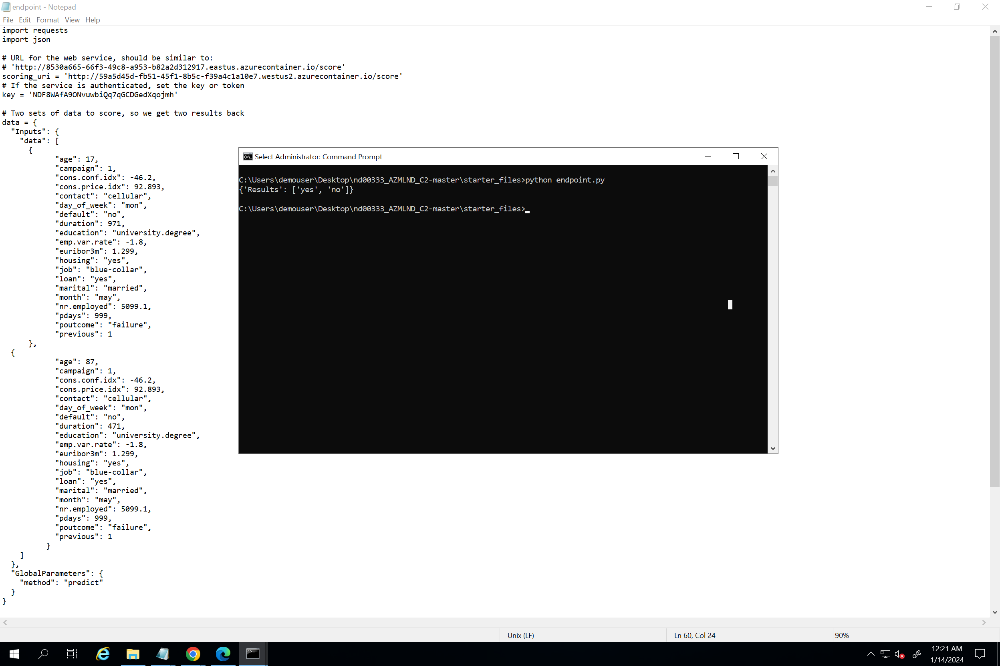
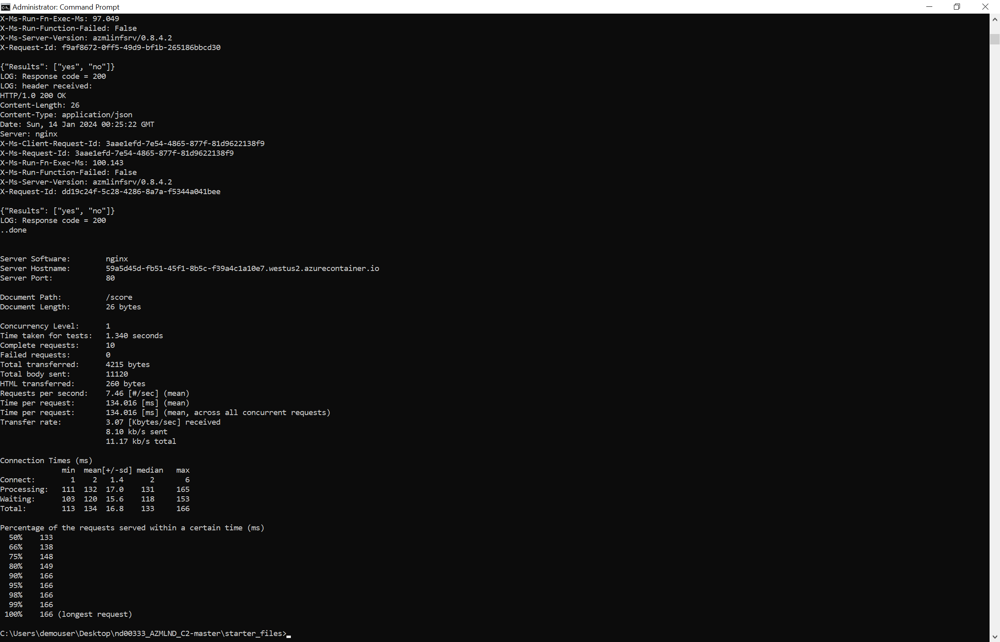
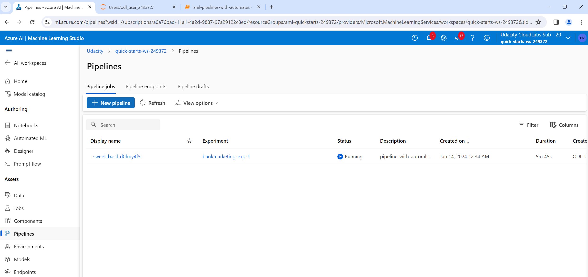

# Machine Learning Production Model for Bank Marketing dataset
Use Azure to configure a cloud-based machine learning production model utilizing the [Bank Marketing dataset](https://automlsamplenotebookdata.blob.core.windows.net/automl-sample-notebook-data/bankmarketing_train.csv), deploy the best model, and consume it. Also create, publish, and consume a pipeline. 

## Architectural Diagram

* Authentication (optional) - Create a Service Principal account and associate it with the workspace. Not authorized with Udacity access.
* Auto ML experiment - upload Dataset, create compute cluster, use Auto ML classification and define parameters
* Deploy the best model - Post completion of the Auto ML experinment, deploy the best mode
* Enable logging -  - Enable application insights
* Swagger Documentation - Swagger setup to view API details
* Consume model endpoint - Consume model endpoint, perform benchmarking
* Create and publish a pipleline - standardize the best practices of producing a machine learning model, enables execution at scale, and improves the model building efficiency
* Documentation - Finish documentation

## Key Steps
* Create a new Auto ML experiment
* Create Dataset in Azure
  
* Create a new compute cluster (aml_compute)
* Auto ML experiment complete
  
* Best model - Voting Ensemble
  
* Best model - stats
  
* Deploy the best model, enable logging and application insights
  
  
* Setup Swagger for the APIs
  
* Consume Model endpoints
  
* AB Benchmarking
  
* Create and publish a pipeline
  

  Azure ML Pipeline
  
  
  
  Pipeline Completed
  

  Notebook - Run Details
  

  Published Pipeline overview
  
  
  Pipeline Jobs
  

  Pipeline run details
  

  Pipeline run details - Azure ML Studio
  

  
## Screen Recording
Please download/ view the mp4 screen recording from:
[Screen Recording](https://github.com/raman340/uda_project2/blob/master/starter_files/Project%202.mp4)

## Standout Suggestions
* Dataset analysis: Data Imbalance was detected due to higher number of no values as compared to yes
  

* Dataset: Top 4 features
  
